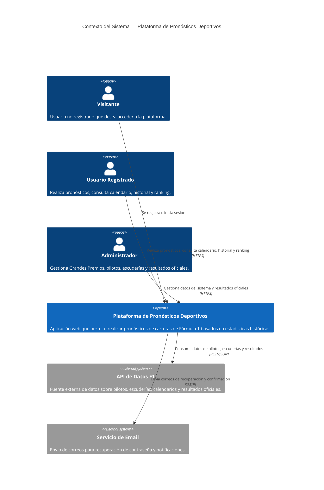
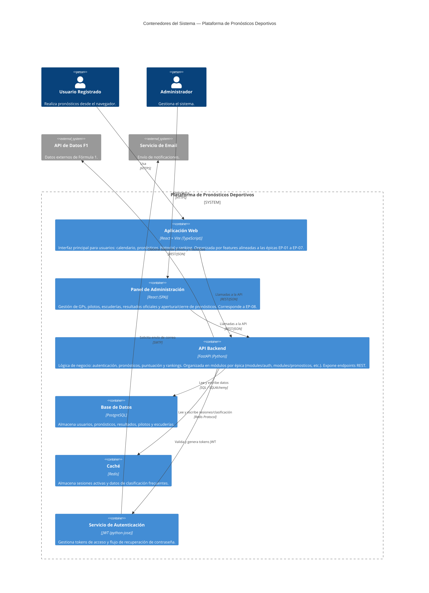

# Diagramación Arquitectónica — Plataforma de Pronósticos Deportivos F1
> Modelado como código en Mermaid.js (estilo C4: Contexto + Contenedores)

---

## Nivel 1 — Diagrama de Contexto del Sistema



---

## Nivel 2 — Diagrama de Contenedores



---

## Estructura del Proyecto

### Backend — `proyecto_f1_bcknd/`

```
proyecto_f1_bcknd/
├── docker-compose.yml
├── Dockerfile
├── requirements.txt
├── init.sql
├── .env.example
│
└── app/
    ├── main.py                    # Punto de entrada, registra todos los routers
    ├── database.py                # Conexión a PostgreSQL (SessionLocal, Base, get_db)
    ├── config.py                  # Variables de entorno centralizadas
    │
    ├── core/
    │   ├── security.py            # JWT, hash de passwords, dependencias de auth
    │   └── exceptions.py          # Excepciones HTTP reutilizables
    │
    └── modules/                   # Un paquete por épica del backlog
        ├── auth/                  # EP-01 Gestión de usuarios
        │   ├── models.py
        │   ├── schemas.py
        │   ├── crud.py
        │   └── router.py          # /auth/register, /login, /logout, /forgot-password
        │
        ├── usuarios/              # EP-02 Gestión del perfil
        │   ├── models.py
        │   ├── schemas.py
        │   ├── crud.py
        │   └── router.py          # /users/me (GET, PUT), /users/me/pronosticos, /users/me/estadisticas
        │
        ├── calendario/            # EP-03 Calendario de Grandes Premios
        │   ├── models.py          # GranPremio
        │   ├── schemas.py
        │   ├── crud.py
        │   └── router.py          # /grandes-premios
        │
        ├── pilotos/               # EP-04 (parte 1) Información de pilotos
        │   ├── models.py          # Piloto
        │   ├── schemas.py
        │   ├── crud.py
        │   └── router.py          # /pilotos, /pilotos/clasificacion
        │
        ├── escuderias/            # EP-04 (parte 2) Información de escuderías
        │   ├── models.py          # Escuderia
        │   ├── schemas.py
        │   ├── crud.py
        │   └── router.py          # /escuderias, /escuderias/clasificacion
        │
        ├── pronosticos/           # EP-05 Pronósticos de carreras
        │   ├── models.py          # Pronostico
        │   ├── schemas.py
        │   ├── crud.py
        │   └── router.py          # /pronosticos (CRUD + confirmar)
        │
        ├── resultados/            # EP-06 Resultados y clasificación
        │   ├── models.py          # ResultadoOficial
        │   ├── schemas.py
        │   ├── crud.py
        │   └── router.py          # /grandes-premios/{id}/resultados, /ranking
        │
        └── admin/                 # EP-08 Panel de administración
            ├── schemas.py
            └── router.py          # CRUD protegido de GPs, pilotos, escuderías,
                                   # resultados oficiales, apertura/cierre de pronósticos
```

> **Nota:** EP-07 (Historial y estadísticas, HU-23 a HU-26) no tiene tablas propias — son consultas agregadas sobre `pronosticos` + `resultados_oficiales`. Sus endpoints viven en `usuarios/router.py` (`/users/me/pronosticos`, `/users/me/estadisticas`) y `resultados/router.py` (`/ranking`).

---

### Frontend — `proyecto_f1_frontend/`

```
proyecto_f1_frontend/
├── package.json
├── vite.config.ts
├── tsconfig.json
│
└── src/
    ├── main.tsx                    # Punto de entrada, monta <App />
    ├── App.tsx                     # Define las rutas (React Router)
    │
    ├── core/
    │   ├── api/
    │   │   └── axiosClient.ts      # Instancia de Axios con baseURL de la API
    │   ├── context/
    │   │   └── AuthContext.tsx     # Estado global de sesión (usuario, token)
    │   ├── hooks/
    │   │   ├── useAuth.ts
    │   │   └── useFetch.ts
    │   └── guards/
    │       ├── PrivateRoute.tsx    # Protege rutas privadas
    │       └── AdminRoute.tsx      # Protege rutas de EP-08
    │
    ├── shared/
    │   └── components/             # Navbar, Card, Button y otros componentes reutilizables
    │
    └── features/                   # Una carpeta por épica
        ├── auth/                   # EP-01
        │   ├── pages/
        │   │   ├── Login.tsx
        │   │   ├── Registro.tsx
        │   │   └── RecuperarPassword.tsx
        │   └── services/
        │       └── authService.ts
        │
        ├── perfil/                 # EP-02
        │   ├── pages/
        │   │   └── EditarPerfil.tsx
        │   └── services/
        │       └── perfilService.ts
        │
        ├── calendario/             # EP-03
        │   ├── pages/
        │   │   ├── ListaGPs.tsx
        │   │   └── DetalleGP.tsx
        │   └── services/
        │       └── calendarioService.ts
        │
        ├── competencia/            # EP-04
        │   ├── pages/
        │   │   ├── Pilotos.tsx
        │   │   └── Escuderias.tsx
        │   └── services/
        │       └── competenciaService.ts
        │
        ├── pronosticos/            # EP-05
        │   ├── pages/
        │   │   ├── FormularioPronostico.tsx
        │   │   └── ConfirmarPronostico.tsx
        │   └── services/
        │       └── pronosticosService.ts
        │
        ├── resultados/             # EP-06
        │   ├── pages/
        │   │   └── Clasificacion.tsx
        │   └── services/
        │       └── resultadosService.ts
        │
        ├── historial/              # EP-07
        │   ├── pages/
        │   │   ├── MisPronosticos.tsx
        │   │   └── Ranking.tsx
        │   └── services/
        │       └── historialService.ts
        │
        └── admin/                  # EP-08
            ├── pages/
            │   ├── GestionGPs.tsx
            │   ├── GestionPilotos.tsx
            │   ├── GestionEscuderias.tsx
            │   └── RegistrarResultados.tsx
            └── services/
                └── adminService.ts
```

---

## Mapeo Épica → Módulo backend → Módulo frontend

| Épica | Módulo backend                             | Módulo frontend (React)  |
|-------|--------------------------------------------|--------------------------|
| EP-01 | `modules/auth`                             | `features/auth`          |
| EP-02 | `modules/usuarios`                         | `features/perfil`        |
| EP-03 | `modules/calendario`                       | `features/calendario`    |
| EP-04 | `modules/pilotos` + `modules/escuderias`   | `features/competencia`   |
| EP-05 | `modules/pronosticos`                      | `features/pronosticos`   |
| EP-06 | `modules/resultados`                       | `features/resultados`    |
| EP-07 | consultas en `usuarios` + `resultados`     | `features/historial`     |
| EP-08 | `modules/admin`                            | `features/admin`         |

---

## Notas de diseño

| Contenedor        | Responsabilidad principal                                                        |
|-------------------|----------------------------------------------------------------------------------|
| **Web App**       | UI para usuarios: pronósticos, calendario, historial, ranking (React + Vite)     |
| **Admin Panel**   | CRUD de GPs, pilotos, escuderías; cierre de pronósticos; resultados (React SPA)  |
| **API Backend**   | Toda la lógica de negocio; punto único de acceso a datos (FastAPI)               |
| **Base de Datos** | Persistencia de usuarios, pronósticos, resultados y estadísticas (PostgreSQL)    |
| **Caché (Redis)** | Sesiones JWT y clasificaciones de alta demanda                                   |
| **Auth Service**  | Emisión/validación de JWT y flujo de recuperación de contraseña (python-jose)    |
