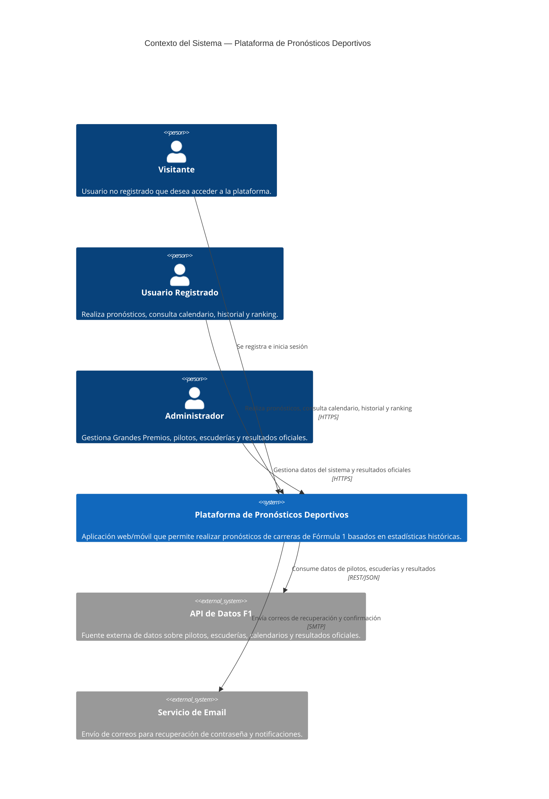
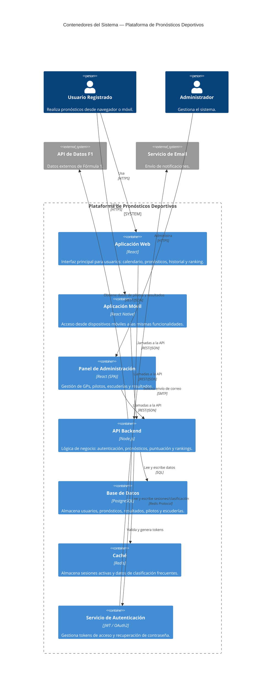

# Diagramación Arquitectónica — Plataforma de Pronósticos Deportivos

> Modelado como código en Mermaid.js (estilo C4: Contexto + Contenedores)

---

## Nivel 1 — Diagrama de Contexto del Sistema

---

## Nivel 2 — Diagrama de Contenedores

---

## Notas de diseño

| Contenedor        | Responsabilidad principal                                           |
| ----------------- | ------------------------------------------------------------------- |
| **Web App**       | UI para usuarios: pronósticos, calendario, historial, ranking       |
| **Mobile App**    | Misma experiencia en dispositivos móviles                           |
| **Admin Panel**   | CRUD de GPs, pilotos, escuderías; cierre de pronósticos; resultados |
| **API Backend**   | Toda la lógica de negocio; punto único de acceso a datos            |
| **Base de Datos** | Persistencia de usuarios, pronósticos, resultados y estadísticas    |
| **Caché (Redis)** | Sesiones JWT y clasificaciones de alta demanda                      |
| **Auth Service**  | Emisión/validación de JWT y flujo de recuperación de contraseña     |
